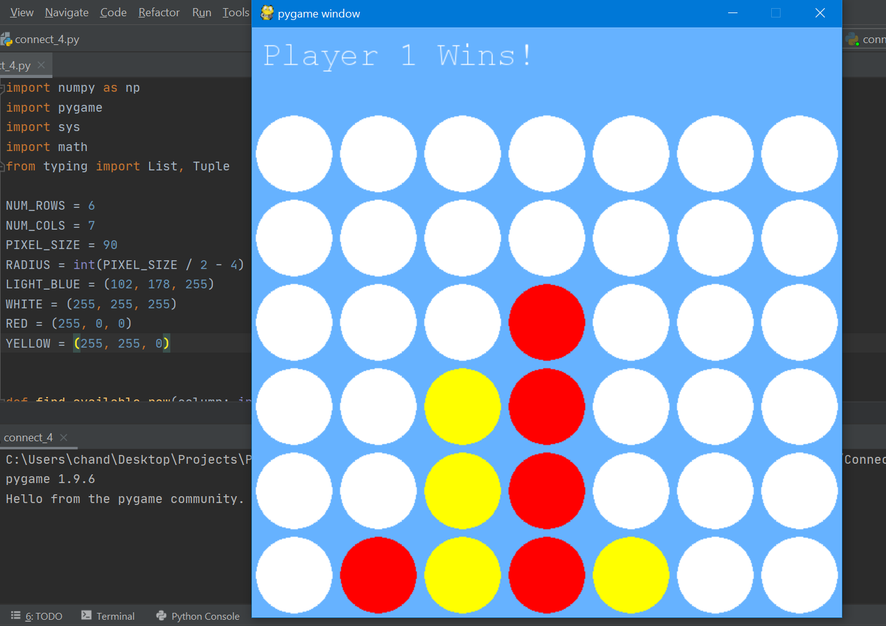
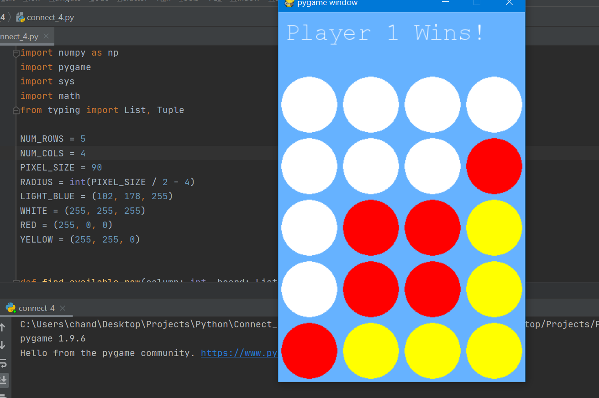

# Connect 4 using Pygame
Classic Connect 4 with Pygame GUI. All boards size is supported (default: 6 by 7).

* [What program looks like](#what-program-looks-like)
* [Features](#features)
* [Dependencies](#dependencies)
* [How to run program](#how-to-run-program)
* [How to play (controles)](#how-to-play-controls)

## What program looks like

## Features

* Flexible implementation allows for playing with any sized board (Simply change NUM_ROWS and NUM_COLS)
* Comprehensible UI

## Dependencies

* [Python](https://www.python.org/downloads/)
* Python IDE - Any will work such as [Pycharm](https://www.jetbrains.com/pycharm/download/)
* [Pygame](https://www.pygame.org/download.shtml)

## How to run program

1. Fork/download manually/clone the repo.
2. Open file in Python IDE & Run connect_4.py

## How to play (Controls)

Player 1 == Red pieces  
Player 2 == Yellow pieces

Use the mouse to move the piece to any column.  
Left click the mouse to drop a piece into a column.
